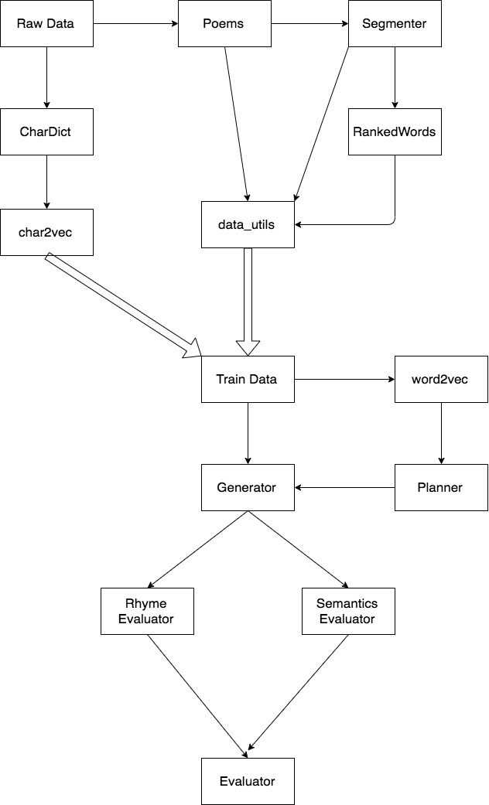

# Planning-based Chinese Poem Generation

A classical Chinese Poem generator based on the Transformer framework.

Here we tried to implement the planning-based architecture purposed in 
[Wang et al. 2016](https://arxiv.org/abs/1610.09889),
whereas technical details might be different from the original paper.

## Code Structure

The diagram above illustrates structure and major dependencies in
this project. Where arrows represents class or function is being used by another class/function. Thick arrows represents data is generated by some classes/functions.

## Dependencies

* Python 3.6.5

* [Numpy 1.14.4](http://www.numpy.org/)

* [TensorFlow 2.0](https://www.tensorflow.org/)

* [Jieba 0.39](https://github.com/fxsjy/jieba)

* [Gensim 2.0.0](https://radimrehurek.com/gensim/)

## Usage Instcutions

### Data Preprocessing

Run data_utils main function to generate training data from raw data:

    Python3 data_utils.py

The TextRank algorithm may takes longer to train.

### Training the planner

run:

    Python3 train.py -p

### Training the generator

    Python3train.py -g
    
If training data or planner is previously trained, running the above command will NOT re-train them. You will need to first clean the pre-recorded data:

    Python3 train.py --clean

You can also choose to train the both models altogether by running:

    Python3train.py -a

## To Generate Poems

run the following command:

    Python3 main.py

You will be prompted to enter a title or hint for your poem as an input to the model. The model will generate a 4-sentence poem based on the message provided.

## Future Work

* apply a new method to better tuning rhythm and tone

* Current transformer model does not perform very well. We need to address the poor performance of our Transformer model.

* Try to implement BERT instead of Transformer

## Acknowledgement
The data preprocessing source code is based on [DevinZ1993](https://github.com/DevinZ1993/Chinese-Poetry-Generation)'s implementation. 

